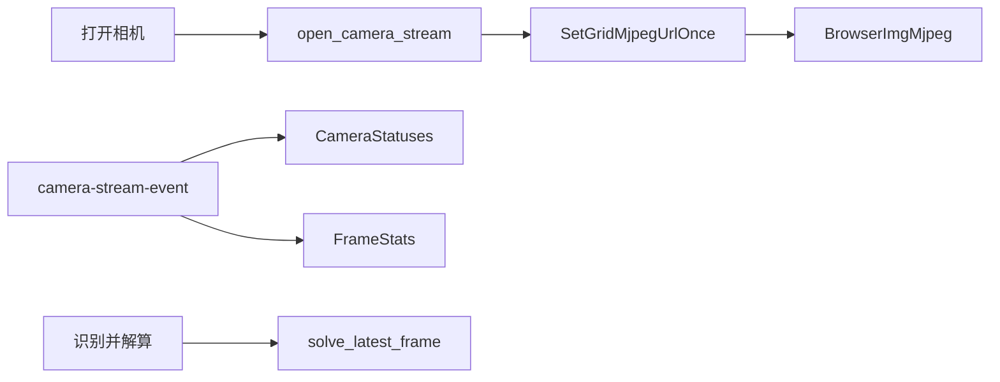

# 相机协议深度重构设计

## 背景

当前相机预览链路表面上是“后台推送”，实际实现是前端定时轮询：

1. `src/App.tsx` 通过 `setInterval` 调用 `capture_frame`。
2. `robo-app/src/lib.rs` 在 Tauri command 中同步等待后端抓取一整帧拼接图。
3. `crates/robo-camera/src/lib.rs` 对多个相机槽位串行 `capture_slot`。
4. 后端把 RGB 拼接图重新编码成 JPEG，写入 `latest_frame`。
5. 前端再通过本地 HTTP URL 拉取 JPEG；失败时降级为 `latest_frame_data_url`，用 base64 通过 IPC 传大 payload。

这个设计把预览帧率绑定在前端轮询、Tauri IPC、串行多相机抓帧、整图 JPEG 编码和 HTTP 二次拉取上。任一路相机慢、断联、重连或编码耗时增加，都会拖慢整个画面刷新。

## 设计目标

- 每路相机独立采集，互不阻塞。
- 预览图像走二进制流，不再每帧通过 JSON/base64/IPC 传输。
- 前端只在打开相机时建立稳定 stream URL，不再每帧调用 `capture_frame`。
- 状态、连接事件、FPS、抓帧耗时、编码耗时走事件通道，与图像载荷分离。
- 识别解算复用后端缓存的最新帧，不再为了识别抢占相机重新抓帧。
- 保留旧 `capture_frame` 路径作为兼容能力，但不作为主预览协议。
- 设备枚举和相机格式查询增加短期缓存，减少重复系统探测和临时打开相机。
- 相机槽位代表固定拍摄位置；参数调节界面打开时锁定槽位交换，避免调参对象和画面位置同时变化。
- 格式选择只展示原生相机支持且适合预览的格式：FPS 不低于 30，分辨率在 320x240 到 1920x1080 之间，并限制为常用 4:3 或 16:9。

## 新协议概览

### 控制面

前端通过 Tauri commands 控制相机流生命周期：

- `open_camera_stream(configs)`：启动相机流，返回 `gridUrl`、`slotUrls`、初始尺寸和状态。
- `close_camera_stream()`：关闭相机流。
- `camera_stream_info()`：读取当前流信息。
- `snapshot_frame()`：返回最新 grid JPEG 的二进制快照。
- `solve_latest_frame(rois)`：用最新 grid RGB 帧识别并解算。

状态更新通过 Tauri event：

- 事件名：`camera-stream-event`
- 内容：`kind`、`slot`、`index`、`seq`、`width`、`height`、`fps`、`captureMs`、`encodeMs`、`message`、`statuses`

### 数据面

图像预览走本地 MJPEG endpoint：

- `/grid.mjpeg`：兼容现有 ROI 坐标和单张拼接图 UI。
- `/slot/{slot}.mjpeg`：每路相机独立流，为后续 4 tile UI 预留。

前端打开相机后只设置一次 ``，浏览器持续消费 MJPEG multipart stream。主预览链路不再调用 `capture_frame`，也不再降级到 data URL。

## 后端架构

```mermaid
flowchart LR
  openCameraStream[open_camera_stream] --> cameraRuntime[CameraStreamRuntime]
  cameraRuntime --> slotWorker0[CameraSlotWorker0]
  cameraRuntime --> slotWorker1[CameraSlotWorker1]
  cameraRuntime --> slotWorker2[CameraSlotWorker2]
  cameraRuntime --> slotWorker3[CameraSlotWorker3]
  slotWorker0 --> eventQueue[SlotEventQueue]
  slotWorker1 --> eventQueue
  slotWorker2 --> eventQueue
  slotWorker3 --> eventQueue
  eventQueue --> aggregator[StreamAggregator]
  aggregator --> frameHub[FrameHub]
  frameHub --> gridStream[/grid.mjpeg]
  frameHub --> slotStreams[/slot/{slot}.mjpeg]
  frameHub --> solveLatestFrame[solve_latest_frame]
  aggregator --> frontendEvents[camera-stream-event]
```

### `CameraSlotWorker`

每个槽位一个 worker：

- 独立打开相机。
- 按该槽位配置的 FPS 连续抓帧。
- 抓帧成功后发送 `FramePacket`。
- 连接、断联和错误通过 `CameraSlotWorkerEvent` 上报。
- 关闭时设置 stop flag，不同步等待可能卡在驱动调用里的线程，避免 UI 关闭/重开被底层相机驱动挂住。

### `FrameHub`

`FrameHub` 是后端相机流的共享缓存：

- 保存每个 slot 的最新 RGB 帧、JPEG 帧、状态和序号。
- 保存最新 grid RGB/JPEG 帧。
- 用 `Condvar` 唤醒 MJPEG reader。
- 维护 `session_id`，防止旧 detached worker 在关闭/重开后把旧帧写入新 stream。
- grid 编码节流到约 30 FPS，避免任一路相机每来一帧都重编整张拼接图。

### MJPEG 服务

本地 HTTP 服务继续使用 `tiny_http`，但新增真正的 multipart stream：

- 每个请求独立线程处理，避免一个 stream 阻塞其他请求。
- `MjpegStreamReader` 实现 `Read`，按需等待 `FrameHub` 的新帧。
- 每个 part 包含 `Content-Type: image/jpeg` 和 `Content-Length`。
- 旧 `/frame.jpg?seq=...` 能力保留给兼容路径。

## 前端架构



前端变化：

- 移除主预览 effect 中的 `setInterval(capture_frame)`。
- `openCamera` 调用 `open_camera_stream` 并设置 `imageSrc = stream.gridUrl`。
- 使用 `listen("camera-stream-event")` 更新相机状态、FPS、抓帧耗时和编码耗时。
- `solveFromFrame` 在相机打开时调用 `solve_latest_frame`，否则保留旧 `solve_current_frame` fallback。
- 流式预览期间暂不读取/写入硬件控制参数，避免旧 `CameraWorker` 与新 stream worker 同时持有相机。
- 槽位参数面板打开时禁用槽位交换；格式下拉只使用当前相机原生上报并通过过滤的格式。

## 关键取舍

### 先保留 `/grid.mjpeg`

本次先让前端继续显示一张拼接图，ROI 坐标逻辑不用大改。这样能先解决最明显的性能设计问题：前端每帧 IPC 轮询、base64 传图和串行多相机抓帧。

代价是后端仍需要合成 grid 并编码一张大图，所以 `/grid.mjpeg` 是迁移兼容方案，不是性能上限方案。

### 同时提供 `/slot/{slot}.mjpeg`

每路独立 MJPEG endpoint 已经预留。后续可以把 UI 改成 4 个独立 ``，这样可以进一步减少 grid 合成和整图编码成本，也能让某一路断联不影响其他路的画面更新。

### 没有优先使用 WebSocket 二进制帧

WebSocket 二进制帧会让前端承担 blob URL 管理、背压和生命周期处理。当前预览需求用 `` 消费 MJPEG 更简单，浏览器原生支持持续解码和显示。

### 没有立即实现 MJPEG 原始帧直通

理想路径是相机输出 MJPEG 时直接转发原始 JPEG bytes，避免 `MJPEG -> RGB -> JPEG`。当前 `nokhwa` 调用路径使用 `decode_image::<RgbFormat>()`，要做原始帧直通需要进一步验证库/驱动是否稳定暴露压缩帧。当前实现先完成架构解耦和并行采集，保留后续优化空间。

## 设计要点

- 前端刷新慢的根因不是 React 渲染，而是预览协议把每帧变成一次同步后端抓取请求。
- 新协议把“请求帧”改成“启动流”，让后端持续产帧，前端稳定消费。
- 每路相机独立 worker 是本次重构的核心边界，避免单路慢相机拖慢全部槽位。
- 图像数据和状态数据分离：图像走 MJPEG，状态走 Tauri event。
- `FrameHub` 是共享事实源：预览、快照和识别都从这里取最新帧。
- `session_id` 是流生命周期安全阀：关闭/重开后，旧线程即使恢复也不能污染新流。
- grid stream 是兼容层；slot stream 是下一阶段性能优化入口。
- 设备/格式查询缓存只做短 TTL，避免 UI 高频刷新造成系统枚举抖动，同时不长期隐藏硬件变化。
- 槽位是拍摄位置，不是系统相机 index；交换槽位会让物理相机画面移动到新的拼接位置。
- 调参时锁定槽位交换，保证用户正在看的参数槽不会在同一时间被换到另一个拍摄位置。
- 原生格式过滤在 UI 层执行，后端仍返回完整设备能力；这便于以后按设备型号调整过滤策略。

## 已实现状态

- `crates/robo-camera/src/lib.rs`
  - 新增 `FramePacket`、`CameraSlotWorkerEvent`、`CameraSlotWorker`。
  - 每路相机 worker 独立采集并上报帧/状态。

- `robo-app/src/lib.rs`
  - 新增 `CameraStreamRuntime`、`FrameHub`、`MjpegStreamReader`。
  - 新增 `open_camera_stream`、`close_camera_stream`、`camera_stream_info`、`snapshot_frame`、`solve_latest_frame`。
  - 新增 `/grid.mjpeg` 和 `/slot/{slot}.mjpeg`。
  - 增加 stream session 校验、grid 编码节流和设备/格式缓存。

- `src/App.tsx`
  - 主预览链路改为 MJPEG stream。
  - 监听 `camera-stream-event` 更新状态和性能指标。
  - 相机打开时识别改用 `solve_latest_frame`。
  - 移除预览主路径对 `capture_frame`、`latest_frame_data_url` 的依赖。

## 验证清单

已验证：

- `npm run build` 通过。
- `git diff --check` 通过。
- IDE lints 未报告新增错误。

待验证：

- `cargo check --locked`。
- `cargo test`。
- 真实 4 路相机打开、断开一路、重连一路时的预览表现。
- `solve_latest_frame` 在相机流打开时是否稳定使用最新帧。
- `/grid.mjpeg` 和 `/slot/{slot}.mjpeg` 在长时间运行下是否有内存增长或延迟积压。

## 后续优化

1. 验证 `nokhwa` 是否能稳定暴露原始 MJPEG bytes，若可行则实现每路 JPEG 直通。
2. 前端从单 grid 图迁移为 4 tile UI，ROI 坐标改为 slot-local。
3. 将硬件控制参数读写接入新 stream runtime，避免关闭相机后才能调参。
4. 为 `FrameHub` 增加更细的指标：每 slot 实际 FPS、丢帧数、最新帧年龄、grid 编码耗时分位数。
5. 如 MJPEG 在目标机器上兼容性不足，再评估 WebSocket 二进制帧或 Tauri 自定义协议。
